# Markdown Blocks

A Neovim plugin for Markdown block related tasks.

The `markdown-blocks.nvim` plugin has commands to quote, break, wrap, unwrap, number and renumber Markdown elements.

## Installation

The plugin implements Lua functions to break, quote, number and wrap/unwrap Markdown blocks. Installation is just a matter of creating key mappings to these functions.

- Download and install from the Github [srackham/markdown-blocks.nvim](https://github.com/srackham/digraph-picker.nvim) repo using your preferred Neovim plugin installer.
- Create keyboard mappings to invoke the Lua block functions.

| Function name    | Description                        |
| ---------------- | ---------------------------------- |
| `break_block`    | Toggle ` \` line suffix breaks     |
| `quote_block`    | Toggle `> ` line prefix quotes     |
| `number_block`   | Toggle ordered list line numbers   |
| `renumber_block` | Renumber ordered list line numbers |
| `wrap_block` †   | Wrap lines                         |
| `unwrap_block`   | Unwrap (join) lines                |

† Accepts optional column number argument, if omitted wraps at the current cursor column.

### Example LazyVim Configuration

1. Create a Lua file (e.g. `markdown-blocks.lua`) in the plugins configuration directory (normally `~/.config/nvim/lua/plugins/` on Linux) and add the following code (optionally edit the key bindings):

```lua
return {
  'srackham/markdown-blocks.nvim',
  version = '*', -- Install latest tagged version
  config = function()
    local mb = require('markdown-blocks.nvim')
    vim.keymap.set({ 'n', 'v' }, '<Leader>mb', mb.break_block,
      { noremap = true, silent = true, desc = "Break/unbreak the paragraph/selection at the cursor" })
    vim.keymap.set({ 'n', 'v' }, '<Leader>mq', mb.quote_block,
      { noremap = true, silent = true, desc = "Quote/unquote paragraph/selection at the cursor" })
    vim.keymap.set({ 'n', 'v' }, '<Leader>mw', mb.wrap_block,
      { noremap = true, silent = true, desc = "Wrap paragraph/selection at the cursor column" })
    vim.keymap.set({ 'n', 'v' }, '<Leader>mW', function()
      local col = tonumber(vim.fn.input('Wrap at column: '))
      if col then mb.wrap_block(col) end
    end, { noremap = true, silent = true, desc = "Prompted wrap paragraph/selection" })
    vim.keymap.set({ 'n', 'v' }, '<Leader>mu', mb.unwrap_block,
      { noremap = true, silent = true, desc = "Unwrap paragraph/selection" })
    vim.keymap.set({ 'n', 'v' }, '<Leader>mn', mb.number_block,
      { silent = true, noremap = true, desc = "Number/unnumber non-indented lines" })
    vim.keymap.set({ 'n', 'v' }, '<Leader>mr', mb.renumber_block,
      { silent = true, noremap = true, desc = "Renumber numbered lines" })
  end,
}

```

2. Restart Neovim. LazyVim will detect the new plugin file and install it from Github.

## Usage

In normal mode block functions are applied to the paragraph at the cursor, in visual mode they are applied to the current selection.

- It is recommended that you format Markdown using accepted styling norms, see for example the [Google Markdown style guide](https://google.github.io/styleguide/docguide/style.html), doing this will eliminate a lot of potentially anomalous behavior. [Prettier](https://prettier.io/) is a good choice of code formatter for Markdown.
- It is recommended to use spaces throughout; expand tabs to 4 spaces.

## Screenshots

### Normal mode wrap paragraph

| 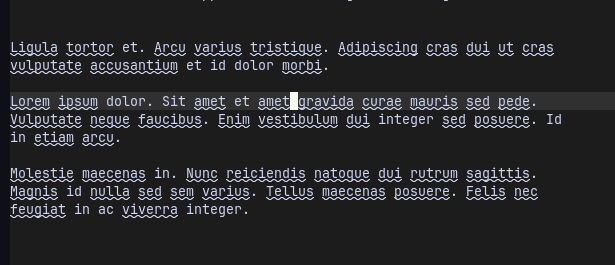 | 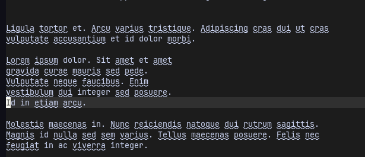 |
| ------------------------------------ | ---------------------------------- |

### Visual mode wrap selection

| 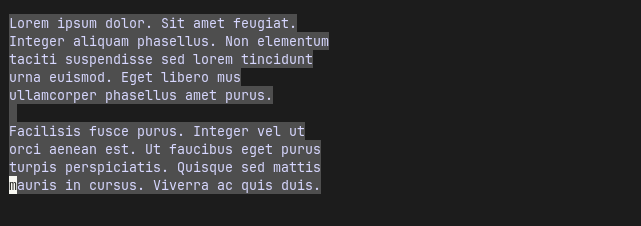 | 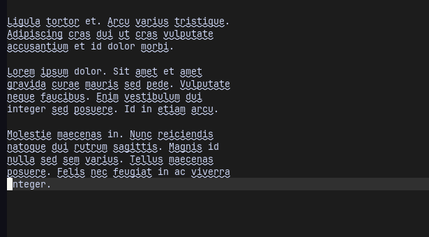 |
| ------------------------------------ | ---------------------------------- |

### Visual mode break selection

| 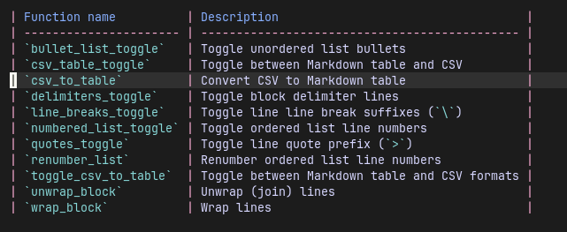 | 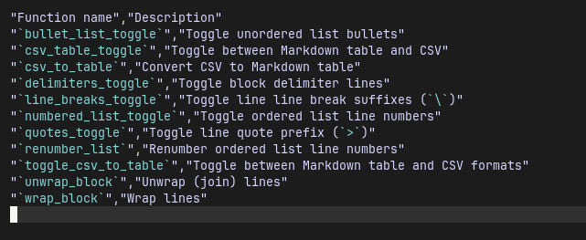 |
| ------------------------------------ | ---------------------------------- |

### Visual mode quote selection

| 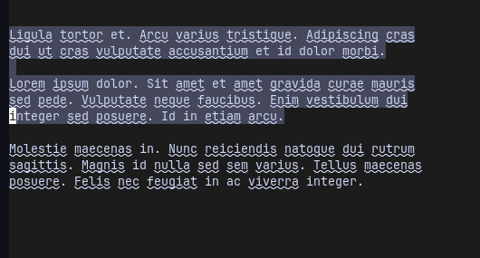 | 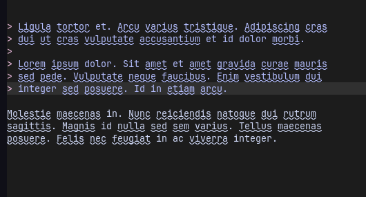 |
| ------------------------------------ | ---------------------------------- |

### Normal mode number paragraph

| 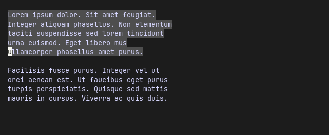 | 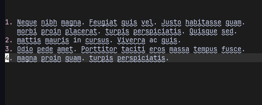 |
| ------------------------------------ | ----------------------------------- |

### Visual mode renumber selection

| 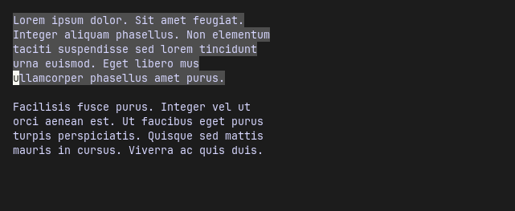 | 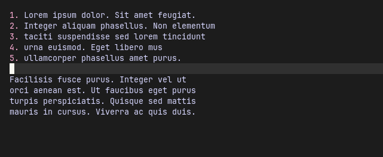 |
| ------------------------------------- | ----------------------------------- |

## Limitations

### Ordered lists

- Does not skip over code blocks, if code blocks contain lists they will be processed.
- Only processes items numbered like `1.` e.g. `1)` is not recognised.
- Does not process quoted numbered lists.
- A list is considered terminated when a subsequent line encroaches into the list's indent.

## Todo

- Do not collapse indents when block quoting.
- Write tests (use the digraph-picker.nvim tests as a model).

<!--
## Test paragraphs

Lorem ipsum dolor. Sit amet feugiat. Integer aliquam phasellus. Non elementum
taciti suspendisse sed lorem tincidunt urna euismod. Eget libero mus
ullamcorper phasellus amet purus.

Facilisis fusce purus. Integer vel ut orci aenean est. Ut faucibus eget purus
turpis perspiciatis. Quisque sed mattis mauris in cursus. Viverra ac quis
duis.

Lorem ipsum dolor. Sit amet feugiat. Integer aliquam phasellus.
Non elementum taciti suspendisse sed lorem tincidunt urna
euismod. Eget libero mus ullamcorper phasellus amet purus.

1.  Neque nibh magna. Feugiat quis vel. Justo habitasse quam.
    morbi proin placerat. turpis perspiciatis. Quisque sed.
2.  mattis mauris in cursus. Viverra ac quis.
3.  Odio pede amet. Porttitor taciti eros massa tempus fusce.
4.  magna proin quam. turpis perspiciatis.

    1.  Neque est suspendisse pellentesque curabitur hac
        felis ullamcorper nihil.
    2.  Facilisis fusce purus.

```
xxx
```

5. First item
6. Second item
7. Third item
   1. Indented item
   2. Indented item
8. Fourth item

- One space,
  with no indent for wrapped text. 1. Irregular nesting... DO NOT DO THIS.

> Ligula tortor et. Arcu varius tristique. Adipiscing cras
> dui ut cras vulputate accusantium et id dolor morbi.
>
> Lorem ipsum dolor. Sit amet et amet gravida curae mauris
> sed pede. Vulputate neque faucibus. Enim vestibulum dui
> integer sed posuere. Id in etiam arcu.

Molestie maecenas in. Nunc reiciendis natoque dui
rutrum sagittis. Magnis id nulla sed sem varius.
Tellus maecenas posuere. Felis nec feugiat in ac
viverra integer.
