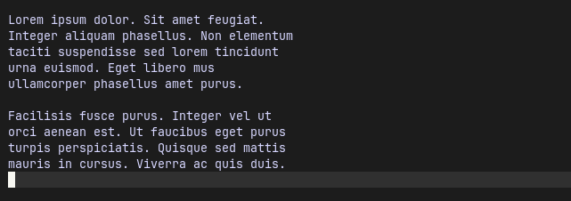
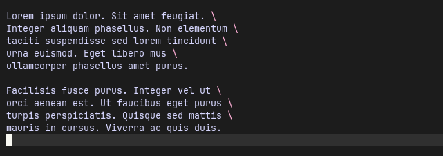
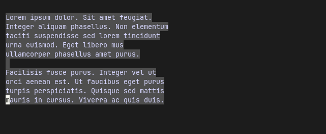
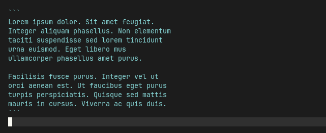

# Markdown Blocks

A Neovim plugin for Markdown block related tasks.

The `markdown-blocks.nvim` plugin has commands to quote, break, wrap, unwrap, number and renumber blocks of Markdown text.

## Screenshots

Here are some of the transformations.

### Wrap paragraphs

|  |  |
| ----------------------------------- | ----------------------------------- |

### Toggle Line breaks

|  |  |
| ----------------------------------- | ----------------------------------- |

### Toggle Markdown table to CSV

|  |  |
| ----------------------------------- | ----------------------------------- |

### Toggle code fence

|  |  |
| ----------------------------------- | ----------------------------------- |

### Toggle list bullets

|  |  |
| ----------------------------------- | ------------------------------------ |

### Toggle list numbers

|  |  |
| ------------------------------------ | ------------------------------------ |

### Toggle ruled block

|  |  |
| ------------------------------------ | ------------------------------------ |

## Usage

In normal mode the block functions are applied to the paragraph at the cursor, in visual mode they are applied to the current selection.

Recommendations:

- Format Markdown using accepted styling norms, see for example the [Google Markdown style guide](https://google.github.io/styleguide/docguide/style.html), doing this will eliminate a lot of potentially anomalous behavior. [Prettier](https://prettier.io/) is a good choice of code formatter for Markdown.
- Use spaces throughout; expand tabs to 4 spaces.

## Installation

The plugin implements Lua functions to break, quote, number, wrap/unwrap and delimit Markdown blocks. To use these functions assign them to custom key mappings.

- Download and install from the Github [srackham/markdown-blocks.nvim](https://github.com/srackham/markdown-blocks.nvim) repo using your preferred Neovim plugin installer.
- Create keyboard mappings to invoke the Lua block functions.

| Function name          | Description                                   |
| ---------------------- | --------------------------------------------- |
| `bullet_list_toggle`   | Toggle unordered list bullets                 |
| `csv_table_toggle`     | Toggle between Markdown table and CSV         |
| `csv_to_table`         | Convert CSV to Markdown table                 |
| `delimiters_toggle` †  | Toggle block delimiter lines                  |
| `line_breaks_toggle`   | Toggle line line break suffixes (`\`)         |
| `numbered_list_toggle` | Toggle ordered list line numbers              |
| `quotes_toggle`        | Toggle line quote prefix (`>`)                |
| `renumber_list`        | Renumber ordered list line numbers            |
| `toggle_csv_to_table`  | Toggle between Markdown table and CSV formats |
| `unwrap_block`         | Unwrap (join) lines                           |
| `wrap_block` ‡         | Wrap lines                                    |

† Passed line delimiter arguments. \
‡ Passed a wrap column number argument.

### Example LazyVim Configuration

1. Create a Lua file (e.g. `markdown-blocks.lua`) in the plugins configuration directory (normally `~/.config/nvim/lua/plugins/` on Linux) and add the following code (edit the key bindings to match your preferences):

````lua
return {
  'srackham/markdown-blocks.nvim',
  enabled = true,
  version = '*', -- Install latest tagged version
  config = function()
    local mb = require('markdown-blocks')

    -- Markdown mappings
    vim.api.nvim_create_autocmd('FileType', {
      pattern = 'markdown',
      callback = function()
        local wrap_column = 100
        vim.keymap.set({ 'n', 'v' }, '<Leader>mb', mb.line_breaks_toggle,
          { noremap = true, silent = true, desc = "Break/unbreak the paragraph/selection at the cursor" })
        vim.keymap.set({ 'n', 'v' }, '<Leader>mq', mb.quotes_toggle,
          { noremap = true, silent = true, desc = "Quote/unquote paragraph/selection at the cursor" })
        vim.keymap.set({ 'n', 'v' }, '<Leader>ml', mb.bullet_list_toggle,
          { noremap = true, silent = true, desc = "Toggle list item bullets in paragraph/selection at the cursor" })
        vim.keymap.set({ 'n', 'v' }, '<Leader>mw', function()
          local col = vim.fn.input("Wrap at column number: ", tostring(wrap_column))
          if col == '' then
            return
          end
          col = tonumber(col)
          if col then
            mb.wrap_block(col)
            wrap_column = col
          end
        end, { noremap = true, silent = true, desc = "Wrap paragraph/selection" })
        vim.keymap.set({ 'n', 'v' }, '<Leader>mu', mb.unwrap_block,
          { noremap = true, silent = true, desc = "Unwrap paragraph/selection" })
        vim.keymap.set({ 'n', 'v' }, '<Leader>mn', mb.numbered_list_toggle,
          { silent = true, noremap = true, desc = "Toggle numbering non-indented lines" })
        vim.keymap.set({ 'n', 'v' }, '<Leader>mr', function() mb.delimiters_toggle('___', '___') end,
          { silent = true, noremap = true, desc = "Toggle ruler delimiters" })
        vim.keymap.set({ 'n', 'v' }, '<Leader>mQ',
          function() mb.delimiters_toggle('<blockquote>\n', '\n</blockquote>') end,
          { silent = true, noremap = true, desc = "Toggle HTML blockquote delimiters" })
        vim.keymap.set({ 'n', 'v' }, '<Leader>mf', function() mb.delimiters_toggle('```', '```') end,
          { silent = true, noremap = true, desc = "Toggle code fence delimiters" })
        vim.keymap.set({ 'n', 'v' }, '<Leader>mF', function()
            local lang = vim.fn.input("Language: ")
            mb.delimiters_toggle('```' .. lang, '```')
          end,
          {
            silent = true,
            noremap = true,
            desc =
            "Toggle code fence delimiters with language code"
          })
        vim.keymap.set({ 'n', 'v' }, '<Leader>mh', function() mb.delimiters_toggle('<!--', '-->') end,
          { silent = true, noremap = true, desc = "Toggle HTML block comment delimiters" })
        vim.keymap.set({ 'n', 'v' }, '<Leader>mc', mb.toggle_csv_to_table,
          { silent = true, noremap = true, desc = "Toggle between Markdown table and CSV" })
      end,
    })
  end,
}
````

2. Restart Neovim. LazyVim will detect the new plugin file and install it from Github.

## Limitations

### Ordered lists

- Does not skip over code blocks, if code blocks contain lists they will be processed.
- Only processes items numbered like `1.` e.g. `1)` is not recognised.
- Does not process quoted numbered lists.
- A list is considered terminated when a subsequent line encroaches into the list's indent.

<!--
## Todo

- Write tests (use the digraph-picker.nvim tests as a model).

## Test paragraphs

Lorem ipsum dolor. Sit amet feugiat. Integer aliquam phasellus. Non
elementum taciti suspendisse sed lorem tincidunt urna euismod. Eget
libero mus ullamcorper phasellus amet purus.

---

Facilisis fusce purus. Integer vel ut orci aenean est. Ut faucibus
eget purus turpis perspiciatis. Quisque sed mattis mauris in cursus.
Viverra ac quis duis.

---

Lorem ipsum dolor. Sit amet feugiat. Integer aliquam phasellus.
Non elementum taciti suspendisse sed lorem tincidunt urna
euismod. Eget libero mus ullamcorper phasellus amet purus.
-->
